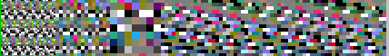
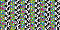
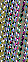

# ROTASPEN DAFNEBR0
 
ROTAS DAFNE OPERA ABRDN 
 
TENET FR0RF AREPO 
 [DAFNE.bmp](https://github.com/user-attachments/files/29166357/DAFNE.bmp)  
 
NDRBA SATOR 
  
[6030.bmp](https://github.com/user-attachments/files/29166348/6030.bmp) [60302.bmp](https://github.com/user-attachments/files/29166351/60302.bmp) ENFAD 
[60303p.bmp](https://github.com/user-attachments/files/29166527/60303p.bmp) 
 [60303pv.bmp](https://github.com/user-attachments/files/29166354/60303pv.bmp)  
 
 

